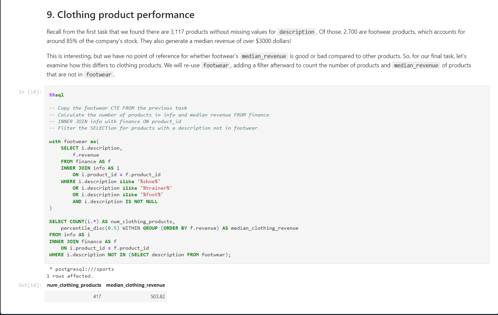

* This is a project to assess, using sql how to maximise profitability for a firm in the sports apparel and athleisure outfit market.

Sports apparel and athleisure wear is a significant sector, valued around $193 billion in 2021, with a robust growth projection over the following decade!

In this notebook, we assume the position of a product analyst for an online sports apparel firm.
The corporation is primarily interested in how it might enhance revenue.
We will look into product data such as price, reviews, descriptions, and ratings, as well as revenue and website traffic, to provide suggestions for its marketing and sales teams.

The database supplied to us, sports, comprises five tables, with product id being the primary key for all of them (see notebook). 

